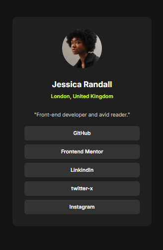

# Frontend Mentor - QR code component solution

This is a solution to the [Social links profile challenge on Frontend Mentor](https://www.frontendmentor.io/challenges/social-links-profile-UG32l9m6dQ). Frontend Mentor challenges help you improve your coding skills by building realistic projects.

## Table of contents

- [Frontend Mentor - QR code component solution](#frontend-mentor---qr-code-component-solution)
  - [Table of contents](#table-of-contents)
  - [Overview](#overview)
    - [Screenshot](#screenshot)
      - [Mobile design](#mobile-design)
      - [Desktop design](#desktop-design)
      - [Active-state design](#active-state-design)
    - [Links](#links)
  - [My process](#my-process)
    - [Key Implementation Details](#key-implementation-details)
    - [Built with](#built-with)
    - [What I learned](#what-i-learned)
    - [Useful resources](#useful-resources)
  - [Author](#author)

## Overview

This mini project is a responsive social profile card built using semantic HTML and modern CSS. It showcases a user’s name, location, a short bio, and provides visually styled links to various social media platforms. The design is clean, minimalistic, and mobile-first, ensuring it looks good across different device sizes.
The project focuses on:

- Semantic HTML structure for accessibility

- Flexbox for clean, responsive layout

- Basic styling to achieve a visually appealing card design

- A mobile-friendly design without the use of media queries.

### Screenshot

#### Mobile design



#### Desktop design

  

#### Active-state design


### Links

- Solution URL: [https://github.com/Randy-22/Social-links-profile-main](https://github.com/Randy-22/Social-links-profile-main)
- Live Site URL: [https://randy-22.github.io/Social-links-profile-main/](https://randy-22.github.io/Social-links-profile-main/)

## My process

This project was built using **semantic HTML5 and modern CSS3** to create a clean, responsive social card componenet. All styles were applied through an **external CSS file** to maintain separation of structure and design.

The HTML consists of a main `.container` that uses Flexbox to center a single `.social-card` component both vertically and horizontally on the page. The card displays a featured image, article tags, publishing date, heading, description, and author information—all structured for accessibility and clarity.

### Key Implementation Details

- Responsive Layout with clamp():
I used the `clamp()` CSS function to make the font size and card width responsive without relying on media queries. This allows the design to scale fluidly across screen sizes while respecting minimum and maximum limits.

- Flexbox Centering:
The `.container` uses Flexbox to center the `.social-card` in the viewport, creating a balanced and professional layout across all devices.

- BEM Naming Convention:
Class names are structured following the **BEM (Block Element Modifier)** methodology. This improves code organization, prevents style conflicts, and enhances reusability for future components.

- Global variables:
One key aspect of this project was the implementation of CSS global variables, which helped promote reusability and maintainability across the codebase.

- Hover Interaction:
 I also applied :hover and :focus-visible effects on links to improve interactivity and accessibility.

- Typography:
I used the  `"Inter", sans-serif;` font from Google Fonts for modern readability.

### Built with

- Semantic HTML5 markup
- CSS3 custom properties
- Flexbox
- Google Fonts

### What I learned

One key takeaway from this project was the practical use of **CSS transitions and transforms**. I applied these to enhance interactivity—such as subtle hover and focus effects on the social links—making the profile card feel more dynamic and engaging.

Another valuable lesson was learning to build responsive designs without relying heavily on media queries. Instead, I used the `clamp()` function for widths, paddings, margins, and font sizes, allowing the layout to adapt fluidly across screen sizes with minimal code.

Additionally, I discovered the benefit of using CSS custom properties (variables). Defining global variables improved code maintainability and reusability, especially when working with consistent color schemes and spacing values throughout the project.
Specifically, I defined color variables in the :root selector at the top of my CSS file. This allowed me to store commonly used color values in one place and reference them consistently throughout the stylesheet.

To see how you can add code snippets, see below:

```css
.social-card__links li:hover,
.social-card__links a:focus-visible {
  transform: translateY(-3px);
}

.social-card__links > ul > li {
  transition: background-color .15s ease, transform .15s ease;
}

:root {
  --clr-bg: hsl(0, 0%, 8%);
  --clr-card: hsl(0, 0%, 12%);
}

body {
  background-color: var(--clr-bg);
}
```

### Useful resources

- [CSS flex-box Tricks](https://css-tricks.com/snippets/css/a-guide-to-flexbox/) - This site provides user friendly and a simple way to really grasp the concept of CSS flex box.
- [CSS clamp() Function](https://www.w3schools.com/cssref/func_clamp.php) - You can find out more on CSS clamp function on W3schools.
- [CSS transition Function](https://www.w3schools.com/css/css3_transitions.asp) - Learn more about CSS transform here.

## Author

- github - [Randy Sekyere](https://github.com/Randy-22)
- Frontend Mentor - [@Randy-22](https://www.frontendmentor.io/profile/Randy-22)
